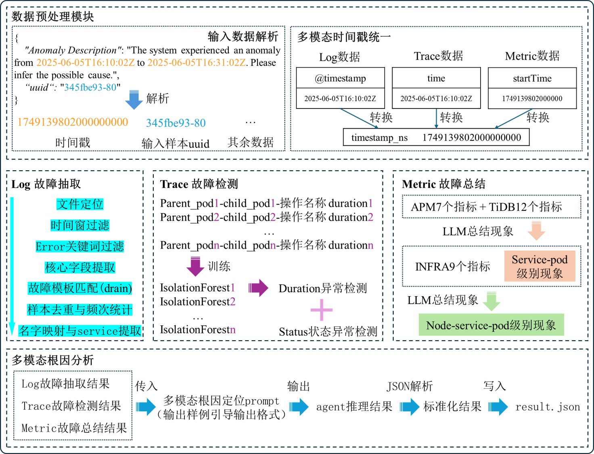

# MicroRCA-Agent：基于大模型智能体的微服务根因定位方法
## 国际AIOps挑战赛 (初赛第6，48.52分)
## 项目概述

本项目是一个基于多模态数据分析的智能运维解决方案，能够处理日志(Log)、链路追踪(Trace)和指标(Metric)数据，通过大语言模型进行故障分析和根因定位。采用模块化架构设计，整体系统分为五个核心模块：数据预处理模块、日志故障抽取模块、追踪故障检测模块、指标故障总结模块和多模态根因分析模块。各模块间采用松耦合设计，通过函数封装进行数据交互，既保证了系统的整体性，又确保了各模块的独立性和可扩展性。
输出包含component、reason、reasoning_trace的结构化根因分析结果，实现从现象观察到根因推理的完整闭环。



## 文件结构说明

```
├── README.md              # 项目文档
├── domain.conf           # 外网域名配置
├── src/                  # 源代码目录
│   ├── agent/           # 智能代理模块
│   │   ├── __init__.py  # 包初始化文件
│   │   ├── agents.py    # 代理实现
│   │   ├── llm_config.py # LLM配置，在这里配置agent使用的模型列表
│   │   └── prompts.py   # 提示词模板
│   ├── utils/           # 工具模块
│   │   ├── drain/       # Drain日志模板提取
│   │   │   ├── drain_template_extractor.py # Drain模板提取器
│   │   │   ├── drain3.ini              # Drain3配置文件
│   │   │   ├── error_log-drain.pkl     # 预训练好的模板提取模型
│   │   │   └── error_log-template.csv  # 日志模板文件
│   │   ├── __init__.py  # 包初始化文件
│   │   ├── file_utils.py # 文件处理工具
│   │   ├── io_util.py   # IO工具
│   │   ├── llm_record_utils.py # LLM记录工具
│   │   ├── log_template_extractor.py # 日志模板提取器（训练errot_log-drain.pkl）
│   │   ├── log_template_extractor_with_examples.py # 带示例的日志模板提取器（用于观察训练的drain提取效果）
│   │   ├── log_utils.py # 日志处理工具（用于调用日志信息供大模型使用）
│   │   ├── metric_utils.py # 指标处理工具（用于调用指标信息供大模型使用）
│   │   └── trace_utils.py # 链路追踪处理工具（用于调用链路追踪信息供大模型使用）
│   ├── models           # 模型（trace异常检测模型）
│   ├── scripts/         # 数据预处理脚本，包括统一log、trace、metric的时间戳等操作
│   │   ├── merge_phaseone_phasetwo_input_json.py # 将 phaseone 和 phasetwo 的 input.jsonl 合并成一个 input.jsonl 的脚本
│   │   ├── raw_log_processor.py      # 原始日志处理
│   │   ├── raw_metric_processor.py   # 原始指标处理
│   │   └── raw_trace_processor.py    # 原始链路追踪处理
│   ├── models/          # 模型文件
│   │   ├── trace_detectors.pkl       # trace异常检测检测器模型
│   │   └── trace_detectors_normal_stats.pkl # trace正常状态统计
│   ├── input/           # 输入数据处理
│   │   ├── extract_input_timestamp.py # 时间戳提取
│   │   └── input_timestamp.csv       # 提取了输入的时间戳等信息，便于后期调用
│   ├── submission/      # 提交结果
│   │   ├── result.jsonl # 结果文件
│   │   └── submit.py    # 提交脚本
│   ├── main_multiprocessing.py # 主程序入口
│   ├── preprocessing.sh # 数据预处理脚本（如果需要下载和预处理）
│   └── requirements.txt # Python依赖
├── data/                # 下载并且与处理好的数据文件目录
├── Dockerfile          # Docker镜像构建文件
└── run.sh              # 启动脚本
```

## 技术方案详述

### 1. 多模态数据处理

#### 1.1 日志数据处理
- **Drain3 算法**: 使用预训练的Drain3模型(`error_log-drain.pkl`)进行日志模板提取
  - 自动识别日志模式，将相似的日志归类到同一模板
  - 大幅减少日志数据量，提取关键错误信息
  - 支持日志去重和频次统计
- **多层过滤机制**:
  - 时间范围过滤：精确定位故障时间窗口内的日志
  - 错误关键词过滤：只保留包含'error'的关键日志
  - 注入错误过滤：自动排除测试注入的错误日志
  - Pod级别采样：按Pod分组进行智能采样

#### 1.2 链路追踪 (Trace) 处理
- **异常检测模型**: 使用IsolationForest算法构建trace异常检测器
  - 预训练模型存储：`trace_detectors.pkl` 和 `trace_detectors_normal_stats.pkl`
  - 基于正常时期的trace数据训练，识别异常trace模式
  - 支持多维度特征提取和异常评分
- **时间窗口分析**: 使用滑动窗口技术分析trace的时序特征
- **服务拓扑感知**: 自动提取服务间调用关系

#### 1.3 指标数据 (Metric) 处理
- **多层级指标分析**:
  - Node级指标：CPU、内存、网络、磁盘等系统指标
  - Pod级指标：容器级别的资源使用情况
  - Service级指标：业务服务的性能指标
  - TiDB专项指标：数据库特定的性能指标
- **统计分析技术**:
  - 异常值检测和过滤
  - 故障期与正常期的对比分析
  - 指标阈值判断和趋势分析

### 2. 大语言模型智能

#### 2.1 模型架构
- **AutoGen框架**: 使用微软AutoGen构建AI代理
- **多模型支持**:
  - DeepSeek系列: deepseek-chat, deepseek-v3:671b, deepseek-r1:671b等
  - Qwen系列: qwen3:235b
  - 支持模型自动容错和切换

#### 2.2 提示词工程
- **分层分析策略**:
  - 单模态分析：分别对log、trace、metric进行专项分析
  - 多模态融合：综合三种数据源进行根因分析
- **结构化输出**: 严格的JSON格式输出，包含：
  - component: 故障组件识别
  - reason: 根本原因分析
  - reasoning_trace: 完整的推理过程追踪

### 3. 高性能处理

#### 3.1 并行计算
- **多进程架构**: 基于CPU核心数动态调整进程池大小(默认0.5倍核心数)
- **任务分片**: 将故障时间段分片并行处理

#### 3.2 容错机制
- **重试策略**: 每个时间段最多重试3次处理
- **异常隔离**: 单个时间段处理失败不影响整体流程
- **数据缺失容忍**: 某些类型的数据（如log、trace或metric）缺失时，系统仍可利用现有数据继续进行分析

### 4. 数据预处理

#### 4.1 时间戳统一
- **多源时间对齐**: 统一log、trace、metric的时间格式
- **时区处理**: 北京时间标准化处理
- **精度控制**: 纳秒级时间戳精确匹配

#### 4.2 特征工程
- **服务名提取**: 从Pod名自动提取服务名
- **网络拓扑构建**: 基于trace数据构建服务调用关系
- **指标聚合**: 多维度指标的统计聚合和特征提取

### 5. 方案优势：

1. **准确性**: 多模态数据互相验证，提高故障定位准确性
2. **效率**: 并行处理和模型预训练，大幅提升处理速度
3. **可扩展性**: 模块化设计，易于扩展新的数据源和分析算法
4. **鲁棒性**: 多层容错机制，保证系统稳定运行

### 6. 根因结果输出示例（字段组合视任务而定）:
```bash
{
  "uuid": "33c11d00-2",
  "component": "checkoutservice",
  "reason": "disk IO overload",
  "reasoning_trace": [
    {
      "step": 1,
      "action": "LoadMetrics(checkoutservice)",
      "observation": "disk_read_latency spike"
    },
    {
      "step": 2,
      "action": "TraceAnalysis('frontend -> checkoutservice')",
      "observation": "checkoutservice self-loop spans"
    },
    {
      "step": 3,
      "action": "LogSearch(checkoutservice)",
      "observation": "IOError in 3 logs"
    }
  ]
}
   ```
## 前置依赖安装

### Git LFS 安装（必需）

由于项目数据文件使用Git LFS进行管理，运行前需要先安装并配置Git LFS。

#### 🐧 在 Ubuntu 上安装 Git LFS

**✅ 步骤 1：添加 Git LFS 的仓库**
```bash
curl -s https://packagecloud.io/install/repositories/github/git-lfs/script.deb.sh | sudo bash
```
这个命令会自动添加 Git LFS 的官方 APT 源。

**✅ 步骤 2：安装 Git LFS**
```bash
sudo apt-get install git-lfs
```

**✅ 步骤 3：初始化 Git LFS**
安装完成后，运行以下命令来启用 Git LFS：
```bash
git lfs install
```
这将配置 Git 以支持 LFS 功能。

**🔍 验证是否成功安装 Git LFS**
通过以下命令验证是否正确安装并启用了 Git LFS：
```bash
git lfs version
```
输出示例：
```
git-lfs/3.6.1 (GitHub; linux amd64; go 1.23.3)
```

## 环境要求

- Docker 服务已启动
- 足够的系统内存（多进程处理）
- 网络连接（需要访问外部API）

## 运行方式

### 快速启动

```bash
bash run.sh
```

## 配置说明

### 环境变量

项目需要配置以下环境变量（通过 `src/.env` 文件或系统环境变量），默认是官方提供的队伍 api key，可自行修改：

- `KEJIYUN_API_KEY`: LLM API密钥
- `KEJIYUN_API_BASE`: LLM API基础地址

### API配置

项目支持多个LLM模型：
- deepseek-chat
- deepseek-v3:671b
- deepseek-r1:671b
- deepseek-r1:671b-0528
- deepseek-r1:671b-64k
- qwen3:235b

## 可能遇到的问题及解决方案

### 1. Docker相关问题

**问题**: Docker服务未运行
```
错误: Docker 服务未运行或权限不足
```

**解决方案**:
```bash
# 启动Docker服务
sudo systemctl start docker

# 将用户添加到docker组
sudo usermod -aG docker $USER
# 重新登录或执行
newgrp docker
```

**问题**: Docker镜像构建失败
```
错误: Docker 镜像构建失败
```

**解决方案**:

1. 配置加速器

```bash
sudo tee /etc/docker/daemon.json <<-'EOF'
{
  "registry-mirrors": [
    "https://docker.m.daocloud.io",
    "https://dockerproxy.com",
    "https://docker.mirrors.ustc.edu.cn",
    "https://docker.nju.edu.cn",
    "https://vp5v3vra.mirror.aliyuncs.com",
    "https://docker.registry.cyou",
    "https://docker-cf.registry.cyou",
    "https://dockercf.jsdelivr.fyi",
    "https://docker.jsdelivr.fyi",
    "https://dockertest.jsdelivr.fyi",
    "https://mirror.baidubce.com",
    "https://docker.m.daocloud.io",
    "https://docker.nju.edu.cn",
    "https://docker.mirrors.sjtug.sjtu.edu.cn",
    "https://docker.mirrors.ustc.edu.cn",
    "https://mirror.iscas.ac.cn",
    "https://docker.rainbond.cc"
  ]
}
EOF
```

2. 重启 Docker 服务

```bash
sudo systemctl daemon-reload
sudo systemctl restart docker

```

### 2. 网络连接问题

**问题**: LLM API访问失败

**解决方案**:
- 检查 src/.env 文件中环境变量 `KEJIYUN_API_KEY` 和 `KEJIYUN_API_BASE` 是否正确配置（默认使用的队伍 api）

### 3. 内存不足问题

**问题**: 容器运行时内存不足导致程序崩溃，机器卡死

**解决方案**:
- 建议可以手动修改多进程数量，在src/main_multiprocessing.py中调整进程池大小（默认使用65%的核心数），但是如果内存太小可能导致爆满导致机器卡死，请关注内存使用情况，如果爆满，请将其修改至合适的比例:
```python
num_processes = max(1, int(cpu_count() * 0.5))
```

## 注意事项

1. 确保所有依赖的外部服务（LLM API）可正常访问
2. 建议在性能较好的机器上运行，处理大量数据时可能需要较长时间

## 致谢

感谢CCF AIOps 2025挑战赛组委会提供的高质量数据集和良好的竞赛环境，为我们团队提供了宝贵的学习和交流平台。

本项目参与的比赛为：**赛道一: 基于大模型智能体的微服务根因定位**  
比赛官网：[CCF AIOps 2025 Challenge](https://challenge.aiops.cn/home/competition/1920410697896845344)