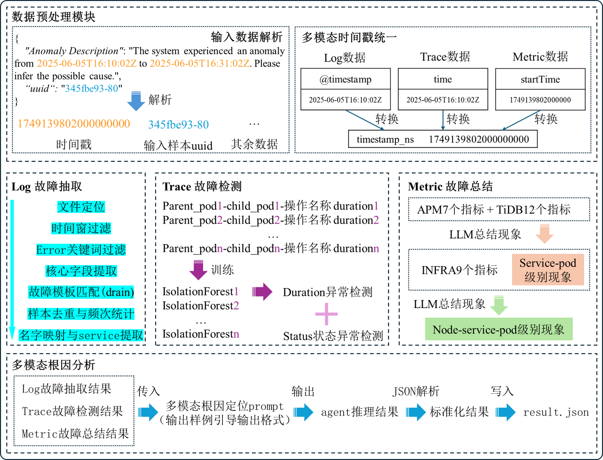

# MicroRCA-Agent：基于大模型智能体的微服务根因定位方法

[English](README.md) | 中文

## 2025 国际 AIOps 挑战赛（决赛 Top5，48.52分）
## 项目概述

本项目是一个基于多模态数据分析的智能运维解决方案，能够处理日志(Log)、链路追踪(Trace)和指标(Metric)数据，通过大语言模型进行故障分析和根因定位。采用模块化架构设计，整体系统分为五个核心模块：数据预处理模块、日志故障抽取模块、追踪故障检测模块、指标故障总结模块和多模态根因分析模块。各模块间采用松耦合设计，通过函数封装进行数据交互，既保证了系统的整体性，又确保了各模块的独立性和可扩展性。
输出包含component、reason、reasoning_trace的结构化根因分析结果，实现从现象观察到根因推理的完整闭环。




## 文件结构说明

```
├── README.md  # 英文项目文档
├── README_zh.md  # 中文项目文档
├── domain.conf  # 外网域名配置
├── src/  # 源代码目录
│   ├── agent/  # 智能代理模块
│   │   ├── __init__.py  # 包初始化文件
│   │   ├── agents.py  # 代理实现
│   │   ├── llm_config.py  # LLM配置，在这里配置agent使用的模型列表
│   │   └── prompts.py  # 提示词模板
│   ├── utils/  # 工具模块
│   │   ├── drain/  # Drain日志模板提取
│   │   │   ├── drain_template_extractor.py  # Drain模板提取器
│   │   │   ├── drain3.ini  # Drain3配置文件
│   │   │   ├── error_log-drain.pkl  # 预训练好的模板提取模型
│   │   │   └── error_log-template.csv  # 日志模板文件
│   │   ├── __init__.py  # 包初始化文件
│   │   ├── file_utils.py  # 文件处理工具
│   │   ├── io_util.py  # IO工具
│   │   ├── llm_record_utils.py  # LLM记录工具
│   │   ├── log_template_extractor.py  # 日志模板提取器（训练errot_log-drain.pkl）
│   │   ├── log_template_extractor_with_examples.py  # 带示例的日志模板提取器（用于观察训练的drain提取效果）
│   │   ├── log_utils.py  # 日志处理工具（用于调用日志信息供大模型使用）
│   │   ├── metric_utils.py  # 指标处理工具（用于调用指标信息供大模型使用）
│   │   └── trace_utils.py  # 链路追踪处理工具（用于调用链路追踪信息供大模型使用）
│   ├── models  # 模型（trace异常检测模型）
│   ├── scripts/  # 数据预处理脚本，包括统一log、trace、metric的时间戳等操作
│   │   ├── merge_phaseone_phasetwo_input_json.py  # 将 phaseone 和 phasetwo 的 input.jsonl 合并成一个 input.jsonl 的脚本
│   │   ├── raw_log_processor.py  # 原始日志处理
│   │   ├── raw_metric_processor.py  # 原始指标处理
│   │   └── raw_trace_processor.py  # 原始链路追踪处理
│   ├── models/  # 模型文件
│   │   ├── trace_detectors.pkl  # trace异常检测检测器模型
│   │   └── trace_detectors_normal_stats.pkl  # trace正常状态统计
│   ├── input/  # 输入数据处理
│   │   ├── extract_input_timestamp.py  # 时间戳提取
│   │   └── input_timestamp.csv  # 提取了输入的时间戳等信息，便于后期调用
│   ├── submission/  # 提交结果
│   │   ├── result.jsonl  # 结果文件
│   │   └── submit.py  # 提交脚本
│   ├── main_multiprocessing.py  # 主程序入口
│   ├── preprocessing.sh  # 数据预处理脚本（如果需要下载和预处理）
│   └── requirements.txt  # Python依赖
├── data/  # 下载并且与处理好的数据文件目录
├── Dockerfile  # Docker镜像构建文件
└── run.sh  # 启动脚本
```

## 技术方案详述

### 1. 数据预处理

#### 1.1 输入数据解析设计
- **正则表达式提取策略**: 对原始故障描述文件进行结构化处理
  - 接收JSON格式输入数据，包含故障描述（Anomaly Description）和唯一标识符（uuid）
  - 时间戳提取机制：采用ISO 8601时间格式标准，通过正则表达式模式识别故障起止时间
  - 时间索引生成：生成"年-月-日_时"格式的时间标识，用于快速定位数据文件
  - 纳秒级时间戳转换：将故障时间转换为19位纳秒级时间戳

#### 1.2 多模态数据时间戳统一
- **差异化时间戳统一处理策略**: 针对log、trace和metric三种数据的不同格式特点
  - Log数据：采用ISO 8601格式的@timestamp字段，转换为统一的19位纳秒级时间戳
  - Trace数据：startTime字段存储微秒级时间戳，通过精度转换扩展为纳秒级（乘以1000倍数）
  - Metric数据：time字段遵循ISO 8601格式，采用递归搜索策略确保完整覆盖分散存储的指标文件
- **时序一致性保障**: 处理完成后按时间戳升序排列，确保跨模态时间基准的标准化

### 2. 多模态数据处理

#### 2.1 日志数据处理
- **Drain3 算法**: 基于包含error的日志训练Drain3模型，并使用预训练的Drain3模型(`error_log-drain.pkl`)进行日志模板提取
  - 自动识别日志模式，将相似的日志归类到同一模板
  - 大幅减少日志数据量，提取关键错误信息
  - 用于日志去重和频次统计
- **多层级数据筛选处理流程**:
  - 文件定位：根据时间信息精准匹配故障时间窗口内的日志文件
  - 时间窗过滤：基于纳秒级时间戳进行严格的时间边界筛选
  - Error关键词过滤：提取包含error信息的日志条目，过滤正常业务日志
  - 核心字段提取：提取时间、容器、节点和错误消息等关键信息
  - 故障模板匹配：利用预训练Drain模型进行模板匹配与标准化
  - 样本去重统计：对重复日志去重并统计频次，评估故障严重程度
  - 服务信息提取：将Pod信息映射为service，重构为标准化格式

#### 2.2 链路追踪 (Trace) 处理
- **双重异常检测策略**: 结合性能维度和状态维度识别微服务调用链中的异常模式
  - Duration异常检测：基于IsolationForest算法检测调用时延异常
  - Status状态检测：直接检查status.code和status.message识别错误状态
- **IsolationForest性能异常检测**:
  - 预训练模型存储：`trace_detectors.pkl` 和 `trace_detectors_normal_stats.pkl`
  - 基于故障恢复后40分钟正常期数据训练，按"parent_pod-child_pod-操作名称"分组训练
  - 采用30秒滑动窗口处理duration特征，设置1%异常污染率
- **状态码直接检查机制**:
  - 解析trace tags中的status.code和status.message字段
  - 通过条件过滤（status.code≠0）直接识别异常状态调用
  - 提供确定性的错误状态识别和详细错误信息
- **调用关系映射**: 提取pod_name、service_name、node_name，建立完整的调用链父子关系
- **结构化输出**: 分别输出前20个duration异常和status异常组合，包含节点、服务、容器、操作等维度信息

#### 2.3 指标数据 (Metric) 处理
- **双层级大模型现象总结策略**: 基于大语言模型的智能现象识别与归纳分析
  - 第一层：应用性能监控现象识别与总结（APM指标+TiDB数据库组件指标）
  - 第二层：基础设施机器性能指标综合现象总结与关联分析
- **多层级监控指标体系**:
  - APM业务监控：7个核心指标（error_ratio、request、response、rrt、timeout等）
  - Pod容器层：9个基础设施指标（cpu_usage、memory、network、filesystem等）
  - Node节点层：16个基础设施指标（cpu、memory、disk、network、TCP连接等）
  - TiDB数据库：3个组件共20个专项指标（query、duration、connection、raft等）
- **智能数据筛选与处理**:
  - 正常时间段定义：故障前后相邻时间窗口，前一故障结束后10分钟至当前故障开始前，以及当前故障结束后10分钟至下一故障开始前，避免故障"余波"影响
  - 统计对称比率筛选：自动过滤变化幅度小于5%的稳定指标
  - 异常值移除：移除最大最小各2个极值，构建稳定统计基线
  - Pod-Service统一分析：通过Pod名称自动提取Service标识
- **llm总结输出内容**:
  - 应用性能异常现象：服务级别整体趋势和Pod级别个体差异
  - 基础设施机器性能异常现象：跨容器和节点的资源状态变化
  - 跨层级关联现象模式：异常分布特征和传播路径识别

### 3. 高性能处理

#### 3.1 并行计算
- **多进程架构**: 基于CPU核心数动态调整进程池大小(默认0.5倍核心数)
- **任务分片**: 将故障时间段分片并行处理

#### 3.2 容错机制
- **重试策略**: 每个时间段最多重试3次处理
- **异常隔离**: 单个时间段处理失败不影响整体流程
- **数据缺失容忍**: 某些类型的数据（如log、trace或metric）缺失时，系统仍可利用现有数据继续进行分析

### 4. 根因结果输出示例（字段组合视任务而定）:
```bash
{
  "uuid": "33c11d00-2",
  "component": "checkoutservice",
  "reason": "disk IO overload",
  "reasoning_trace": [
    {
      "step": 1,
      "action": "LoadMetrics(checkoutservice)",
      "observation": "disk_read_latency spike"
    },
    {
      "step": 2,
      "action": "TraceAnalysis('frontend -> checkoutservice')",
      "observation": "checkoutservice self-loop spans"
    },
    {
      "step": 3,
      "action": "LogSearch(checkoutservice)",
      "observation": "IOError in 3 logs"
    }
  ]
}
   ```
## 前置依赖安装

### Git LFS 安装（必需）

由于项目数据集和权重文件使用Git LFS进行管理，运行前需要先安装并配置Git LFS。

#### 🐧 在 Ubuntu 上安装 Git LFS

**✅ 步骤 1：添加 Git LFS 的仓库**
```bash
curl -s https://packagecloud.io/install/repositories/github/git-lfs/script.deb.sh | sudo bash
```
这个命令会自动添加 Git LFS 的官方 APT 源。

**✅ 步骤 2：安装 Git LFS**
```bash
sudo apt-get install git-lfs
```

**✅ 步骤 3：初始化 Git LFS**
安装完成后，运行以下命令来启用 Git LFS：
```bash
git lfs install
```
这将配置 Git 以支持 LFS 功能。

**🔍 验证是否成功安装 Git LFS**
通过以下命令验证是否正确安装并启用了 Git LFS：
```bash
git lfs version
```
输出示例：
```
git-lfs/3.6.1 (GitHub; linux amd64; go 1.23.3)
```

### Python 依赖安装（必需）

项目的数据预处理脚本（`src/preprocessing.sh`中调用的Python脚本）需要使用`src/requirements.txt`中指定的依赖包。

**✅ 创建conda环境并安装依赖**

```bash
# 创建Python 3.10环境
conda create -n microrca python=3.10

# 激活环境
conda activate microrca

# 进入项目目录并安装依赖
cd MicroRCA-Agent
pip install -r src/requirements.txt
```

**⚠️ 注意事项**
- 预处理阶段必须先安装这些依赖，否则会导致数据处理脚本执行失败
- 其他安装环境依赖的方式（如virtualenv、pipenv等）可以根据个人习惯自行配置


## 配置说明

### 环境变量

请添加自己的 deepseek 官方API密钥，通过 `src/.env` 文件配置以下环境变量：

- `KEJIYUN_API_KEY`: LLM API密钥
- `KEJIYUN_API_BASE`: LLM API基础地址

### 模型配置

需要在 `src/agent/llm_config.py` 中设置要使用的模型。默认启用 `deepseek-chat` 模型，如需使用其他模型，请自行添加：


## 运行方式

### 快速启动

**⚠️ 重要提醒：运行前请确保已完成上述配置！**

```bash
bash run.sh
```

## 评测提交与结果查询

### 🏆 评测平台
本项目参与的是**CCF AIOps 2025 挑战赛**中的"基于大模型智能体的微服务根因定位"赛道。

**官方评测平台**：[https://challenge.aiops.cn/home/competition/1963605668447416345](https://challenge.aiops.cn/home/competition/1963605668447416345)

### 📋 评测流程

#### **步骤 1：平台注册与登录**
1. 访问[评测平台](https://challenge.aiops.cn/home/competition/1963605668447416345)并完成账号注册
2. 登录后进入"基于大模型智能体的微服务根因定位"比赛页面

#### **步骤 2：获取团队标识**
1. 登录成功后，点击页面顶部的"**团队**"选项卡
2. 在团队信息页面找到并复制您的"**团队ID**"

#### **步骤 3：配置提交凭证**
编辑 `submission/submit.py` 文件，找到 `TICKET` 变量并替换为您的团队ID：
```python
TICKET = "your_team_id_here"  # 请将此处替换为您的实际团队ID
```

#### **步骤 4：运行算法生成预测结果**
在项目根目录执行主程序：
```bash
bash run.sh
```
> ⏱️ 程序运行完成后，会在项目根目录自动生成 `result.jsonl` 文件

#### **步骤 5：准备提交文件**
将生成的结果文件移动到提交目录：
```bash
cp result.jsonl submission/result.jsonl
```

#### **步骤 6：执行结果提交**
切换到提交目录并运行提交脚本：
```bash
cd submission
python submit.py
```

**✅ 提交成功示例**：
```
Success! Your submission ID is 1757931486600
```
> 📝 请记录这个submission ID，用于后续查询评分结果

#### **步骤 7：查询评测成绩**
使用获得的submission ID查询评分：
```bash
python submit.py -i 1757931486600
```

**📊 评分结果示例**：
```
Submission 1757931486600 score: 0.3275
```
> 🎯 分数越接近1.0表示预测准确性越高

## 可能遇到的问题及解决方案

### 1. Docker相关问题

**问题**: Docker服务未运行
```
错误: Docker 服务未运行或权限不足
```

**解决方案**:
```bash
# 启动Docker服务
sudo systemctl start docker

# 将用户添加到docker组
sudo usermod -aG docker $USER
# 重新登录或执行
newgrp docker
```

**问题**: Docker镜像构建失败
```
错误: Docker 镜像构建失败
```

**解决方案**:

1. 配置加速器

```bash
sudo tee /etc/docker/daemon.json <<-'EOF'
{
  "registry-mirrors": [
    "https://docker.m.daocloud.io",
    "https://dockerproxy.com",
    "https://docker.mirrors.ustc.edu.cn",
    "https://docker.nju.edu.cn",
    "https://vp5v3vra.mirror.aliyuncs.com",
    "https://docker.registry.cyou",
    "https://docker-cf.registry.cyou",
    "https://dockercf.jsdelivr.fyi",
    "https://docker.jsdelivr.fyi",
    "https://dockertest.jsdelivr.fyi",
    "https://mirror.baidubce.com",
    "https://docker.m.daocloud.io",
    "https://docker.nju.edu.cn",
    "https://docker.mirrors.sjtug.sjtu.edu.cn",
    "https://docker.mirrors.ustc.edu.cn",
    "https://mirror.iscas.ac.cn",
    "https://docker.rainbond.cc"
  ]
}
EOF
```

2. 重启 Docker 服务

```bash
sudo systemctl daemon-reload
sudo systemctl restart docker

```

### 2. 网络连接问题

**问题**: LLM API访问失败

**解决方案**:
- 检查 src/.env 文件中环境变量 `KEJIYUN_API_KEY` 和 `KEJIYUN_API_BASE` 是否正确配置（默认使用的队伍 api）

### 3. 内存不足问题

**问题**: 容器运行时内存不足导致程序崩溃，机器卡死

**解决方案**:
- 建议可以手动修改多进程数量，在src/main_multiprocessing.py中调整进程池大小（默认使用50%的核心数），但是如果内存太小可能导致爆满导致机器卡死，请关注内存使用情况，如果爆满，请将其修改至合适的比例:
```python
num_processes = max(1, int(cpu_count() * 0.5))
```

## 注意事项

1. 确保所有依赖的外部服务（LLM API）可正常访问
2. 建议在性能较好的机器上运行，处理大量数据时可能需要较长时间

## 致谢

感谢CCF AIOps 2025挑战赛组委会提供的高质量数据集和良好的竞赛环境，为我们团队提供了宝贵的学习和交流平台。

本项目参与的比赛为：**赛道一: 基于大模型智能体的微服务根因定位**  
比赛官网：[CCF AIOps 2025 Challenge](https://challenge.aiops.cn/home/competition/1920410697896845344)

## Star History

